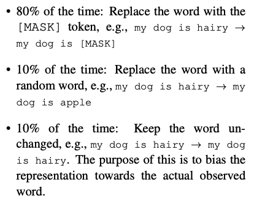
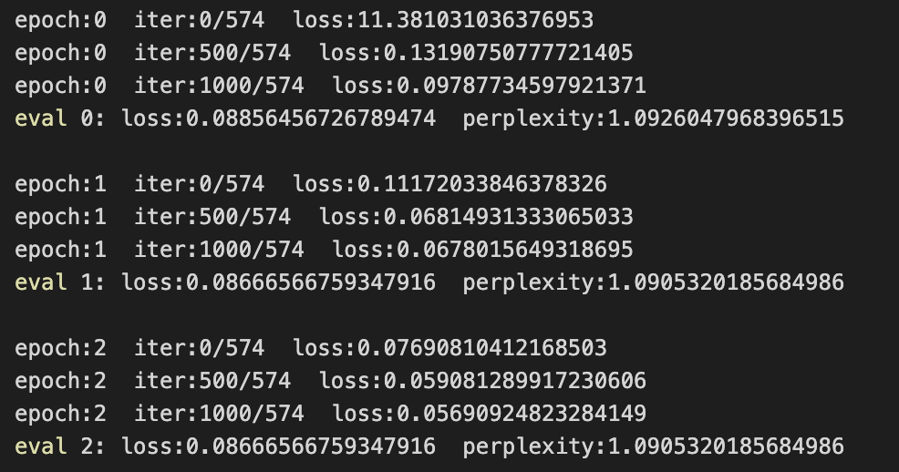

# Pretrain_Bert_with_MaskLM

## Info
使用Mask LM预训练任务来预训练Bert模型。

训练关于垂直领域语料的模型表征，提升下游任务的表现。

基于pytorch。


## Pretraining Task
Mask Language Model，简称Mask LM，即基于Mask机制的预训练语言模型。
使用来自于Bert的mask机制，即对于每一个句子中的词（token）：
* 85%的概率，保留原词不变
* 15%的概率，使用以下方式替换
    * 80%的概率，使用字符'[MASK]'，替换当前token。
    * 10%的概率，使用词表随机抽取的token，替换当前token。
    * 10%的概率，保留原词不变。
    <!-- *  -->
    * 

## Model
使用原生的Bert模型作为基准模型。
* 


## Datasets
项目里的数据集来自wikitext，分成两个文件训练集（train.txt）和测试集（test.txt）。

数据以行为单位存储。

若想要替换成自己的数据集，可以使用自己的数据集进行替换。（注意：如果是预训练中文模型，需要修改配置文件Config.py中的self.initial_pretrain_model和self.initial_pretrain_tokenizer，将值修改成 bert-base-chinese）

自己的数据集不需要做mask机制处理，代码会处理。


## Training Target
本项目目的在于基于现有的预训练模型参数，如google开源的bert-base-uncased、bert-base-chinese等，在垂直领域的数据语料上，再次进行预训练任务，由此提升bert的模型表征能力，换句话说，也就是提升下游任务的表现。


## Environment

项目主要使用了Huggingface的datasets、transformers、accelerate模块，支持单卡单机、单机多卡两种模式。支持使用FP16精度加速训练。


可通过以下命令安装依赖包
```
    pip install -r requirement.txt
```
主要包含的模块如下：
```
    python3.6
    torch==1.3.0
    tqdm==4.61.2
    transformers==4.6.1
    datasets==1.10.2
    numpy==1.19.5
    pandas==1.1.3
```


## Get Start

### 单卡模式
直接运行以下命令
```
    python train.py
```
或修改Config.py文件中的变量self.cuda_visible_devices为单卡后，运行
```
    chmod 755 run.sh
    ./run.sh
```

### 多卡模式
如果你足够幸运，拥有了多张GPU卡，那么恭喜你，你可以进入起飞模式。🚀🚀

（1）使用torch的nn.parallel.DistributedDataParallel模块进行多卡训练。其中config文件中参数如下，默认可以不用修改。
* self.cuda_visible_devices表示程序可见的GPU卡号，示例：'1,2'→可在GPU卡号为1和2上跑，亦可以改多张，如'0,1,2,3'。
* self.device在单卡模式，表示程序运行的卡号；在多卡模式下，表示master的主卡，默认会变成你指定卡号的第一张卡。若只有cpu，那么可修改为'cpu'。
* self.port表示多卡模式下，进程通信占用的端口号。（无需修改）
* self.init_method表示多卡模式下进程的通讯地址。（无需修改）
* self.world_size表示启动的进程数量（无需修改）。在torch==1.3.0版本下，只需指定一个进程。在1.9.0以上，需要与GPU数量相同。

（2）运行程序启动命令
```
    chmod 755 run.sh
    ./run.sh
```

# Experiment
使用交叉熵（cross-entropy）作为损失函数，困惑度（perplexity）和Loss作为评价指标来进行训练，训练过程如下：
<!--  -->


# Reference

【Bert】[https://arxiv.org/pdf/1810.04805.pdf](https://arxiv.org/pdf/1810.04805.pdf)

【transformers】[https://github.com/huggingface/transformers](https://github.com/huggingface/transformers)

【datasets】[https://huggingface.co/docs/datasets/quicktour.html](https://huggingface.co/docs/datasets/quicktour.html)

【accelerate】[https://huggingface.co/docs/accelerate/quicktour.html](https://huggingface.co/docs/accelerate/quicktour.html)


